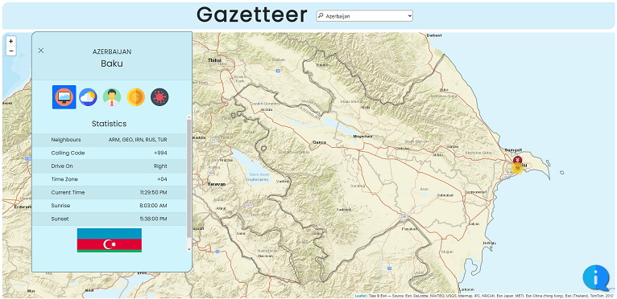
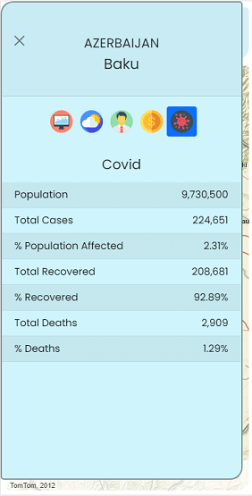

# Gazetteer
gazetteer.kateeliza.co.uk

## Introduction 
This project was built during December 2020 and January 2021 as part of the training requirements for the IT Career Switch course.  
The requirement was to use multiple APIs, Leaflet and a geoJSON file to display information about selected countries.

## Technologies Used
* HTML
* CSS/Bootstrap
* JavaScript/jQuery
* PHP/cURL
* Leaflet / Leaflet.ExtraMarkers

## APIs Used
* [Covid 19 Data](https://rapidapi.com/Gramzivi/api/covid-19-data)
* [Exchange Rate](https://exchangerate.host/)
* [GeoNames](https://www.geonames.org/export/ws-overview.html)
* [IMGUR](https://apidocs.imgur.com/)
* [Language Translation](https://rapidapi.com/cloud-actions-cloud-actions-default/api/language-translation)
* [OpenCage](https://opencagedata.com/)
* [OpenWeather](https://openweathermap.org/)
* [REST Countries](https://restcountries.eu/)
* [Sunrise Sunset](https://sunrise-sunset.org/api)

## Screenshots

